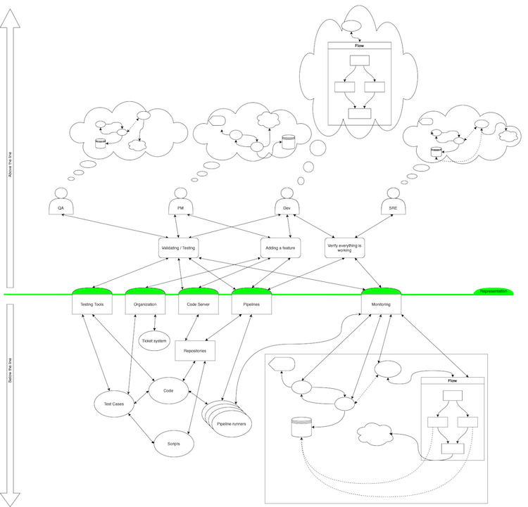

## Introduction

Welcome back to my blog!

In this article I want to challenge how you think about your systems design.
The above-the-line / below-the-line framework was famously created, published, and popularised by [Dr. Richard Cook](https://en.wikipedia.org/wiki/Richard_Cook_(safety_researcher)) in the [SNAFUcatchers Stella Report](https://snafucatchers.github.io/#2_3_The_above-the-line/below-the-line_framework). It might appear weird at first, since it is introducing some level of abstraction between you and the system, but I hope while reading trough the article and reflecting on it, you come to terms with the framework.
If you accept it, it will allow you to write better documentation, communicate better about a system architecture, and come up with better monitoring for it.

I hope you will find this article helpful! If you do - please consider sharing it to your co-workers and friends!

## Modelling a system

When you are performing any kind of systems-design, you will produce diagrams such as the one below. I would argue, most readers of this are familiar with some sort or another of such diagrams and use them almost daily as part of their job.
A typical systems consists of software components running on various servers and clusters behind layers of load balancers and routers, using databases running in close proximity to the application, connecting to 3rd party APIs over the internet, and  presenting results to other systems or users.

And there is absolutely nothing wrong with this systems design overview. Except maybe that it is on a very high level.

But you need some amount of supporting infrastructure in order to run your designed system. Maybe you're depending on a cloud-provider, but most certainly your application code and pipeline definitions exists in repositories. Pipelines are executed by pipeline runners on some other infrastructure. You have additional deployment tools, helper scripts, and so on.

For simplicity let’s focus on the least amount of supporting infrastructure needed: Version Control Servers, Testing Tools, Pipelines, and issue-trackers.
I think we quickly end up with something like this:

Yay - now we successfully managed to map out the most important parts of our system. We have the system itself as well as the supporting infrastructure.

Looks good, right?

## Interacting with a system

Now let’s have a look at the different individuals involved in building, supporting, and using the system. These are the developers, SREs, QA engineers, and program managers.

They all have different backgrounds and might have different intentions when interacting with the system. While the PMs want to push for new features, QA might push for fewer bugs and the SREs might push for higher reliability and resiliency.

But how exactly are they going to interact with the system?

We experience this every day in our jobs. The developers will write code that they push to the repositories in our VCS based on feature-requests of but-tickets in the ticket-system, the SREs will observe the systems state via the monitoring tools to inform decisions about improving reliability, DevOps might improve upon the CI/CD pipelines by editing the YAML files which they push to the VCS for the pipeline-system to pick them up. The QA engineers use the web-frontend of the deployment tool to kick-off a pipeline run deploying to a test-environment,  perform their tests using a vast inventory of testing tools and test descriptions. And then there are our PMs who will write JIRA-Tickets to request new features.

Sounds familiar, doesn't it?

And everyone working in this area knows that there is a problem. The great disconnect between QA who thinks the developers can't write bug-free code, the PMs who think the SREs are unreasonable to push back on a release on a Friday evening because the error budget is exhausted for the month … .

After all, everyone here knows this meme and to some extend relate to it, am I right?:

But why is that?

Because everyone understands the system differently. Everyone has a different mental-model of how the system works. And how it will fail.
No one has a complete understanding of the system.
No one knows exactly how it will fail.
Everyone has different experiences with how the system failed in the past, or how similar systems failed in the past.
This lays in the very nature of every only so slightly complex system. And systems in the area of computer-systems are always complex ones.

## The _above the line / below the line_ framework

After looking at a system itself and the different people interacting with a system, it is time to combine the two into one model and call with the above the line / below the line framework.

We call it that, because we draw a line and put the people interacting with the system and their different mental models and intentions above this line and our beloved complex system below this line.

We call this (green) line the _line of representation_, because whenever we interact with our system, we interact with a representation of our system.

The consequence of this framework is, that everything "below the line" is interfered from the mental models of the individuals and therefore that the system itself  does not exist in the physical world.
We cannot see, touch, or directly control our system.
The only way we can interact with our system is trough the representation layer.

I think unconsciously we know this already.

Why else would we rely on "infrastructure as code"? And why else would we rather commit our CI/CD Pipeline definition and configurations as YAML files than using a bulky UI (looking at you Jenkins)?
We choose a representation that is familiar to us to define our systems state to make it easier to work with.
It is easier for us to inform our mental model based on a known representation. And the other way round, it is easy to translate our mental-model into a representation that is familiar to us.

One very important consequence of this model is, that every time someone makes any change to a system, the change is based on the persons mental model of the system at a certain point in time.

But the data which informs our mental model becomes stale very quickly.
We know that code and configuration changes over time. The same is true for the requirements of our system.
Even the hardware on which system is running changes over time and become less reliable because of bit-rot, degrading optical transceivers, or other variables. 
And finally 3rd party application behavior changes over time thanks to updates, causing a change in the access pattern of your drives or how it uses the network.

We have to accept and live with a constantly changing system.

Every time a system surprises us, that is because our mental model is flawed and or information became stale.

## Challenges

We can't talk about this framework without talking about challenges that arise as a consequence of this system.

I think the most important two are

1. Every individual working with a system must develop and maintain a good-enough mental model of the system.
2. Every individual working with a system must develop and maintain a good-enough understanding of other individuals mental-models of the system.

For new-hires we have the Onboarding-phase in which a new-hire is expected to learn everything about the system. During this phase we build our initial mental-model of the system.

For everyone else we have knowledge-sharing-sessions or something like that.
We have architecture-deep-dive sessions with our peers, or conduct systems-design meetings when planning for big-changes.
And finally we review each-others merge requests.

We don't do all this for the sake of spotting someone else’s mistake.

Instead we validate each others assumptions about how the system behaves and therefore refine each-others mental-models about the system.

What might appears to us as a "design-flaw" or "error" in someone else’s design or code-change might not be because they "did a mistake" but because their mental-model of how the system works and or fails was flawed.

As mentioned above:

> Every time a system surprises us, that is because our mental model is flawed and or information became stale.

This is also true for reviews. If we are surprised by a suggestion to change the design or code, that is likely because our own mental-model isn’t aligned with the mental-model of the person which suggestion you are reviewing.

In my opinion, frequent architecture or design reviews, as well as active participation in merge request reviews are crucial, because this helps us to inform each-other about our mental-models and it makes it easier to get a feeling and understanding of how others form their mental-model.

## Attribution

* [Dr. Richard Cook](https://en.wikipedia.org/wiki/Richard_Cook_(safety_researcher))
* [SNAFUcatchers Stella Report](https://snafucatchers.github.io/#2_3_The_above-the-line/below-the-line_framework)
* [Above the Line, Below the Line. The resilience of Internet-facing systems relies on what is below the line of representation.](https://queue.acm.org/detail.cfm?id=3380777)

[1]: https://snafucatchers.github.io/
[2]: https://sre.google/sre-book/service-level-objectives/
