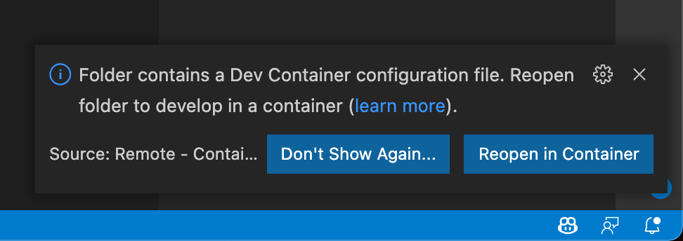
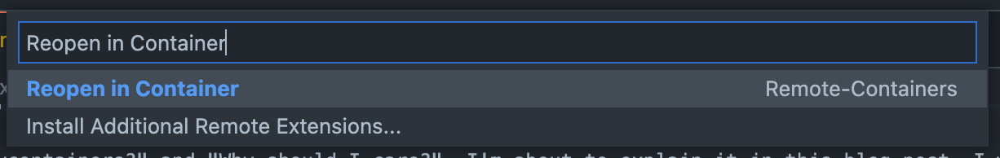

## Introduction

Hi and welcome back to my blog.

I think it's about time to talk about an amazing feature of VScode that I rarely see used in the wild. And honestly: I do not understand why few are using it.
You might have guessed it from the title. The feature is called "devcontainers".

But you might ask: "What are devcontainers?" and "Why should I care?".

I'm about to explain devcontainers in a small series of blog-posts, starting with this one.

In this post I am going to talk about what devcontainers are, why you should care, and what the advantage of devcontainers are.
After reading this I hope you want to add a devcontainer to every Git Repository you work with.

In a second part, I will continue our journey with devcontainers and talk about how to set-up a devcontainer and what resources are available to you when creating them.

## What are devcontainers?

Technically, devcontainers are ordinary (Docker) containers.
But it's not _any_ Docker container. It's a Docker container that is you virtualised development environment. You install all of your development tools (like compilers, code generators, doc generators, and so on) in the devcontainer instead of installing all that on your local machine.

And using devcontainers (using the `devcontainer.json` config) you can even configure VScode. But not only configuration, the configuration can (and should) specify the extensions that will be automatically installed.

And the nice thing: If you have the [`ms-vscode-remote.remote-containers`][1] extension installed and you open a folder in VScode that has a `.devcontainer` folder inside of it, and that folder contains a `devcontainer.json` and a `Dockerfile` VScode will ask you if you want to reopen VScode in the devcontainer:

If it doesn't prompt you, you can select it from the command palette:

You can give it a try right now. The [GitHub Repository][2] hosting this blog comes with a [devcontainer][3].

## Why should you care?

If you're anything like me, it's likely you work with a multitude of programming languages, frameworks, and tools.
You have dozens of repositories checked out and about enough VScode plugins installed, the VScode startup time is comparable to the startup time of VisualStudio 2022 Ultimate Edition.

But it doesn't have to be like this.
With Devcontainers you have the bare minimum VScode installation with the only little configuration or plugins. Startup times are blazingly fast.

You don't have to worry about that ruby installation that you  forgotten about because you tried to get Jekyll running before finally giving up and switching to Hugo.
You don't have to care if you have one codebase uses .NET 4 while the other codebase uses .NET Core 5.
Because that is all taken care of inside of you devcontainer.

Imagine you're a new-hire in your company or a vendor joining a new project, you have to install a dozen different compilers, frameworks, libraries, tools to test, and tools to refactor your code. How long does it take you to get everything setup and being ready to get started? A day, or two?
Imagine you're the Manager of a team and every new-hire or new contractor requires multiple days to get his workstation set-up.

The time wasted with setting up your development environment is almost unbearable. But the solution is simple enough: Put the entire development environment inside of a devcontainer.

The entire setup process would be installing

1. [Git][4]
1. [Docker Desktop][5]
1. [VScode][6]
1. The [`ms-vscode-remote.remote-containers`][1] extension
1. Clone the repository
1. open it in VScode

and boom — you are done!

Wouldn't that be amazing?

Stay tuned for part 2, when we talk about how to set-up a devcontainer.

## Codespaces

The last reason for using Devcontainers is [Codespaces][7].
If you never heard of Codespaces before, here is a quick summary from the [GitHub Codespaces page][7]:

> Use the full power of Visual Studio Code, including the editor, terminal, debugger, version control, settings sync, and the entire ecosystem of extensions. Work in the browser or hand off to your desktop.
>
> Spin up new dev environment for any sized project in seconds with prebuilt images. GitHub’s own 35GB dev image starts in under 10 seconds. Scale your cloud VMs up to 32 cores and 64GB of RAM. And with low-latency connections across four regions, you won’t even remember it’s not your local machine.

If your repository contains a Devcontainer and you’re hosting your Repository on GitHub, you can make use of Codespaces without any further setup required.
No need to install anything on your local machine anymore — heck, you could even code from your iPad.

[1]: https://marketplace.visualstudio.com/items?itemName=ms-vscode-remote.remote-containers
[2]: https://github.com/cedi/cedi.github.io/
[3]: https://github.com/cedi/cedi.github.io/tree/main/.devcontainer
[4]: https://git-scm.com/downloads
[5]: https://docs.docker.com/get-docker/
[6]: https://code.visualstudio.com/download
[7]: https://github.com/features/codespaces