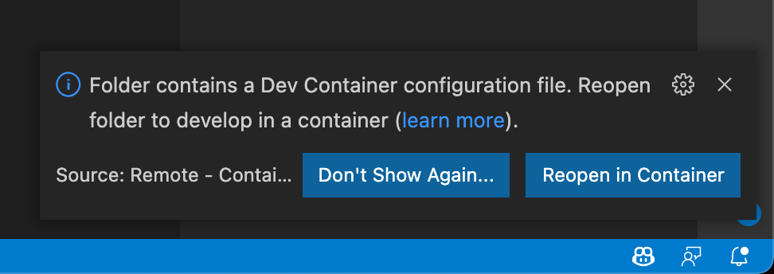
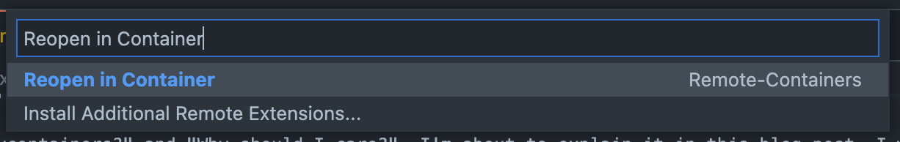

## Introduction

Hi and welcome back to my blog.

I think it's about time to talk about one amazing feature of VScode that I rarely see used in the wild. And honestly: I do not understand why so few are using it.
You might have guessed it from the title already. The feature is called "devcontainers".

But you might ask: "What are devcontainers?" and "Why should I care?".

I'm about to explain devcontainers in a small series of blog-posts, starting with this one.
In this post I am going to talk about what devcontainers are, why you should care, and which advantages devcontainers have.
After reading this I really hope you want to add a devcontainer to every Git Repository you work with.

In a second part, I will continue our journey with devcontainers and talk about how to set-up a devcontainer and what resources are available to you when creating them.

## What are devcontainers?

Well, technically, devcontainers are just ordinary (Docker) containers.
But it's not _just_ any Docker container. It's your entire workspace. Think of it less than a "container" in the common sense. Think of it more like a virtualized development environment. You simply install all of your development tools (like compilers, code generators, doc generators, and so on) in the devcontainer instead of installing all of that on your local machine.

And using devcontainers (specifically the `devcontainer.json`) you can even fully configure VScode too.
But it doesn't end with configuring the settings of VScode. the JSON file can (and should) specify the VScode extensions to install as well.

And the nice thing: If you have the [`ms-vscode-remote.remote-containers`][1] extension installed and you open a folder in VScode that has a `.devcontainer` folder inside of it, and that folder contains a `devcontainer.json` and a `Dockerfile` VScode will ask you if you want to reopen code in said devcontainer:

If it doesn't prompt you, you can just select it from the command palette:

You can actually give it a try right now. The [GitHub Repository][2] hosting this blog comes with a [devcontainer][3] definition.

## Why should you care?

If you're anything like me you most likely work with a multitude of programming languages, frameworks, and tools.
You have dozens of repositories checked out and just about enough VScode plugins installed so the VScode startup time is comparable to VisualStudio 2022 Ultimate Edition.

But what if I told you, it doesn't have to be like this.
Imagine a world, in which you have VScode installed on your local machine, with only the bare minimum of configuration and plugins.
Imagine not having to worry about that ruby installation that you already forgotten about because you tried to get jekyll running before finally giving up and switching to hugo.
Imagine you don't have to worry if you have one codebase uses .NET 4 while the other codebase uses .NET Core 5.

Imagine you're a new-hire in your corp - and I bet every single dev experienced this at least once - you have to install a dozen different compilers or frameworks and libraries and tools to test and refactor your code. How long does it take you to get started? Maybe a day, maybe two?
Imagine you're a Manager and every new-hire or new contractor requires multiple days to get his workstation set-up.

The solution is so simple: Put the entire development environment inside of a devcontainer.

No more need to `sudo apt install build-essential ...` on your local machine.

Just install

* [Git][4]
* [Docker Desktop][5]
* [VScode][6]
* The [`ms-vscode-remote.remote-containers`][1] extension

then clone the repository, open it in VScode, and boom - you are done!

Wouldn't that be amazing?

Stay tuned for part 2, when we talk about how to set-up a devcontainer.

[1]: https://marketplace.visualstudio.com/items?itemName=ms-vscode-remote.remote-containers
[2]: https://github.com/cedi/cedi.github.io/
[3]: https://github.com/cedi/cedi.github.io/tree/main/.devcontainer
[4]: https://git-scm.com/downloads
[5]: https://docs.docker.com/get-docker/
[6]: https://code.visualstudio.com/download